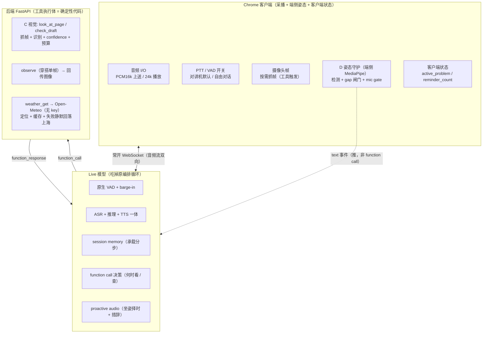
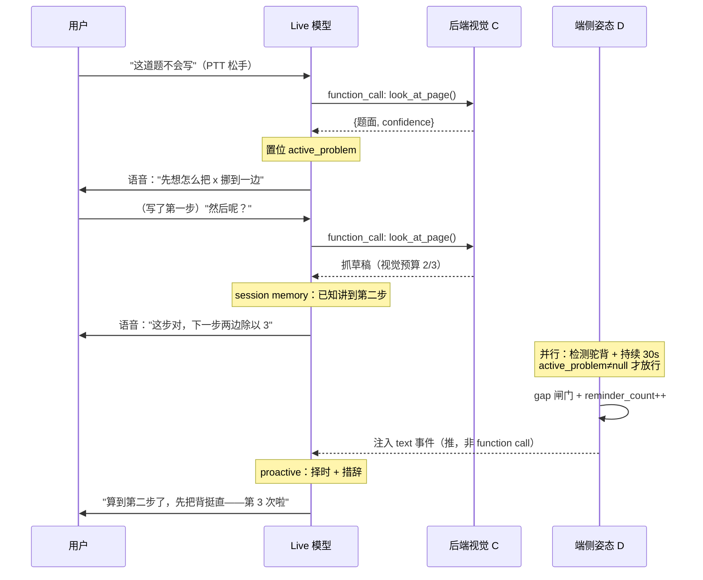
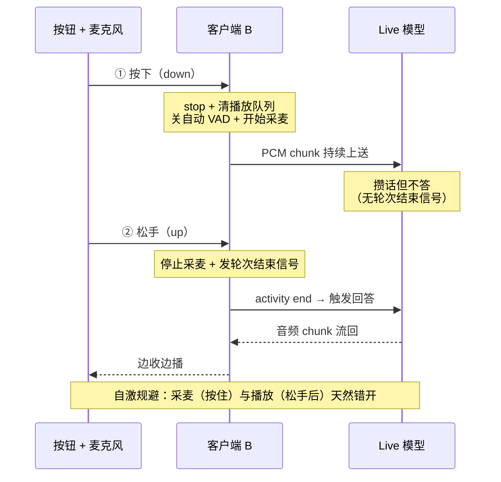
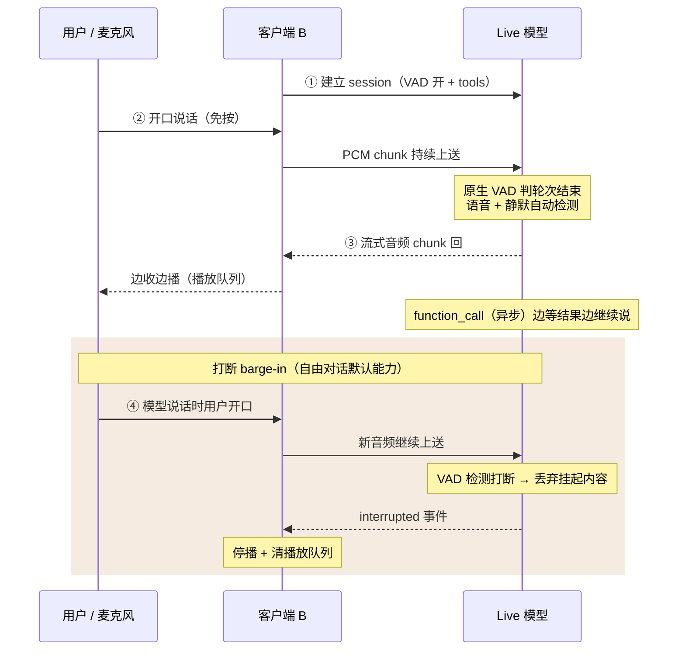

# Visual Assistant — 轻量 PRD（Live 模式）

> 形态：基于实时多模态 speech-to-speech（Gemini Live / OpenAI gpt-realtime）的桌面助手。
> 与原级联版的关键差异：**编排循环与语音工程外包给 Live 模型**，确定性收敛到「工具执行体 + 客户端闸门 + 提示词约束」三件套。

---

## 1. 产品定位

**一句话**：一个「看得见、听得懂、自己会编排」的桌面助手——摄像头 + 麦克风实时多模态交互，由三个场景定义：**学习**（作业辅导 + 坐姿守护）、**生活**（天气穿搭 + 日常）、**开放对话**（什么都能聊）。

**核心取舍**：用 Live 模型一口气退役掉自搓语音链路的第一风险（端到端延迟、打断、自激），代价是确定性护栏从「出站文本拦截」改为「工具返回值约束 + 客户端确定性闸门 + 提示词约束」。

**目标用户**：桌前单用户（以学生为锚，框架不设限）。**不设家长角色。**

**设计原则**
1. 帮忙，但不替你包办——作业默认先引导、不强制纯苏格拉底。
2. 一直在看，但不打扰——坐姿守护后台静默，提醒缝进对话间隙。
3. 看不清就明说，绝不编造——诚实兜底是开放对话的唯一保障。
4. **职责分界**：LLM 决定「做什么、怎么说」；你的代码决定「怎么做到、做几次、做不到/何时放行」。

**范围**：单用户、单设备（带摄像头麦克风的笔记本）、中文语音。**不做**：多用户 / 长期存储 / 移动端原生 App / 图片文件上传 / 执行类工具（订外卖、读屏、控设备一律「帮不上」）/ 家长角色。

---

## 2. 核心场景

| 支柱 | 含义 | 包含能力 | 优先级 |
|---|---|---|---|
| **学习** | 学习时的辅导与照看 | 识题 + 分步指引 + 坐姿守护 | P0 |
| **生活** | 出门 / 日常帮手 | 天气穿搭（唯一牺牲位）+ 日常临场请求 | P1 |
| **开放对话** | 什么都能聊，无预设 | 即兴题 / 问画面 / 闲聊 / 任意请求 | 能力面（基座） |

> **开放对话 = 基座，学习/生活 = 对基座做减法的收窄**。一套 Live 会话 + 多模态 I/O，叠不同约束 profile，不是三条独立流水线。

**学习**：用户指题求助 → 模型自主识题（`look_at_page`）→ 分步指引；分步链条靠 **session memory** 承载（模型记得讲到第几步、学生刚写了什么），不建状态机。坐姿由端侧检测，过 gap 闸门后注入会话，模型结合当前题目进度与提醒次数生成**情境化提醒**。

**生活**：用户对镜头问「这样穿行吗」→ 模型并行调 `observe`（单帧穿搭）+ `weather_get`（温度），融合后给**具体到行动**的建议（加件外套 / 带伞），不播报天气数字。

**开放对话**：无脚本、全交 LLM；自主决定抓帧/调工具；看不清/帮不上即诚实说明，越界请求统一「帮不上」。**定位「接得住任意请求」，而非「答得对」。**

---

## 3. 技术栈

| 层 | 选型 | 说明 |
|---|---|---|
| 前端 | Chrome 页面 | `getUserMedia` + 内建 AEC + WebSocket；PCM 16k 上送 / 24k 播放 |
| 姿态检测 | MediaPipe Pose（端侧） | 颈/背夹角 + 头部位置双条件；100% 端侧、零云调用 |
| 语音轮次 | Live 模型原生 | 原生 VAD / barge-in / 断句；双模式：对讲机 PTT（默认）、自由对话 VAD（高光） |
| 后端 | Python / FastAPI | 单 WebSocket 中继 + 工具执行体（确定性代码） |
| 大脑 | Gemini Live（`gemini-3.1-flash-live-preview`）或 OpenAI `gpt-realtime` | ASR + 推理 + TTS 一体；function calling；session memory；proactive audio |
| 视觉工具 | 后端抓帧 + 识别 | `look_at_page` / `check_draft` / `observe`，返回带 confidence；视觉预算计数 |
| 天气 | Open-Meteo（无 key） | `navigator.geolocation` 定位 + 城市/小时缓存 + 失败静默回落 |

**工具注册表**

| 工具 | 模型发起意图 | 执行体（确定性代码） | 返回 |
|---|---|---|---|
| `look_at_page` | 看一眼纸面 | 抓当前帧 → 识题/读草稿 | 图像帧 or `{text, confidence}` |
| `check_draft` | 看学生写得对不对 | 抓帧 → 批改 | `{verdict, error_line?, confidence}` |
| `observe` | 看画面里的东西 | 抓一帧 | 图像帧 or `{description, confidence}` |
| `weather_get` | 知道天气 | 定位 → Open-Meteo → 缓存/回落 | `{temp, precip}` |

> 坐姿 `posture.alert` 不进工具表——它是**客户端推给模型**的事件，不是模型拉取的工具。

---

## 4. 架构与时序

### 4.1 总体架构

三层：蓝=客户端、紫=Live 模型、绿=后端。核心是**两条方向相反的数据流**——模型用 `function_call` **拉**工具（紫→绿），坐姿用 text 事件**推**给模型（蓝→紫）。确定性留在绿层的工具执行体与蓝层的客户端状态/闸门，模型碰不到。

**模块分工变化**：原编排核心 A 的 planner 循环、原语音 I/O B 自搓的 VAD/打断/半双工，现在都塌进 Live 模型；A 只剩工作记忆 + 工具 dispatch + 坐姿放行门控，B 瘦成采播 + 双模式开关 + WebSocket 中继；视觉 C、姿态 D 基本不变；提示词 E 升格成大脑（分步/反问/穿搭/坐姿措辞的软逻辑都在此）。

---

### 4.2 学习场景时序

上半段是主对话：每次模型要「看」就发一个 `look_at_page`，后端抓帧识别再回传——**分步连续性靠 session memory，不靠状态机**。下半段是并行的端侧姿态：检测与放行判断全在 D/客户端，过 gap 闸门才把 alert **推**进会话，模型用 proactive 择时 + 措辞，把「第二步」「第 3 次」缝进提醒。注意推（D→M）与拉（M→C）方向相反。

---

### 4.3 对讲机 PTT 时序（开场默认，确定性轮次）

PTT 用按钮的物理状态明确界定轮次，不靠模型猜。三个要拧准的点：① 按下瞬间 stop 清队列 + **关自动 VAD**（不关则停顿即被当说完）；② 松手发**轮次结束信号**是触发回答的唯一动作；③ 采麦（按住）与播放（松手后）天然错开，**自激链物理上断掉**——这就是「演打断用对讲机演」的底层原因。

---

### 4.4 自由对话 Live 时序 + 打断 barge-in（高光）

免按、连续流式：音频一直在流，**模型原生 VAD 自动判轮次结束**。招牌是 barge-in——模型说话时用户开口，新音频继续上送，VAD 检测到新人声即丢弃挂起内容、发 `interrupted`，客户端停播清队列。工具往返用**异步 function call** 边等边垫话。代价：嘈杂环境 VAD 误判 + 自激，故需 AEC + 半双工 gate，定位为高光而非默认。

---

## 5. 边际情况

| 类别 | 触发 | 处理 |
|---|---|---|
| 视觉低置信 | 模糊 / 逆光 / 遮挡 | 工具返回 `confidence=low` → 模型请用户挪近 / 口述，**绝不编造** |
| 指代歧义 | 「这道题」但画面多道 | 模型反问一句（native turn-taking），不瞎猜 |
| 抓帧超预算 | 反复举东西 / 连续看 | 工具执行层计数封顶 → 「我已看过，念给我听」 |
| 模式误判 | 把穿搭当作业等 | 无硬护栏（接受的风险）；靠 session memory 自纠 + 坐姿放行并入 `active_problem` 防误吞 |
| 越界请求 | 订外卖 / 读屏 / 控设备 | 无对应工具 → 诚实「帮不上」，不假装 |
| 事实讲错 | 超纲 / 常识题 | 开放对话固有属性，知情接受；定位「接得住」非「答得对」 |
| 工具往返延迟 | weather / observe 往返 | 异步 function call 边等边垫话；首响目标 ≤1.5s |
| 自激 | 模型播报被麦克风收回 | PTT 采播错开天然规避；自由对话需 AEC + 半双工 gate；坐姿播报加 scoped mic gate |
| 断网 | 现场网络弱 | 语音链路强依赖云端、**无离线退路** → 网络预热/保底；天气可写死兜底 |
| 定位失败 | Chrome IP 定位错 / 拒绝 | 静默回落上海或 `MOCK_WEATHER`，不阻塞；demo 默认不念具体城市/温度 |
| 坐姿误触 / 漏报 | 低头写字误判 / mode 抖动吞 alert | 双条件 + 持续阈值防误触；放行并入 `active_problem` 防漏报；demo 用导演触发 |
| 处理中被打断 | 用户在模型说话/抓帧时开口 | `interrupted` → 立即停播 + 清队列 |

---

## 附：关键约束速记

- **职责分界线**：LLM 决定「做什么、怎么说」；你的代码决定「怎么做到、做几次、何时放行」。`function_call` 是两者的接口。
- **确定性的三个落点**：① 工具执行体（去哪取数 / 抓几帧 / 失败回落 / confidence）；② 客户端状态与闸门（`active_problem` / `reminder_count` / gap 判定 / mic gate）；③ 提示词约束（措辞 / 升级语气 / 择时软上界）。
- **坐姿三条**：检测端侧、放行客户端（并入 `active_problem`）、措辞与择时交模型（proactive + 「最多等一句」软兜底）。
- **无 mock 退路的命门**：识题/批改质量、语音链路本身（断网无退路）——这两处真机预实测。